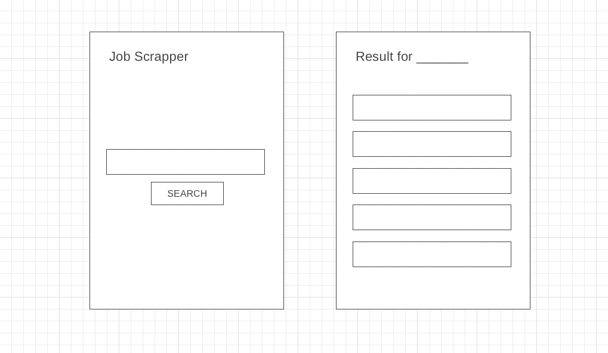

# py_scrapper

## Project Description

This is an app to display job search result using Python & Flask. Users can look up and export the database.

## URLs

- [Repo](https://github.com/Bom-dev/py_scrapper)
- [Live Link](https://job-scrapper-bom.herokuapp.com)

## Technologies

- Python, Flask, HTML, Pico CSS, Heroku

## Wire Frames

## Models

- Home (Search keyword for jobs)
- Jobs (Display search results with locations)
- Export (Download search result file)

## User Stories

- A user can search job list from the keyword they chose
- A user can browse job listing as their keywords
- A user can download csv file for the future

### MVP Goals

- Display job listing according to the keyword the user choose
- Style it using Pico CSS
- Organize the result clearly
- Decrease waiting time when the user already have the database
- Set a export to file button for the result

### Stretch Goals

- Display direct links to apply for the job
- Display more information about the job
- Set options to choose which website to search
